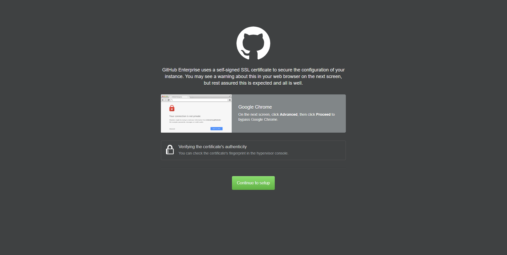

- ## DNS Configuration
- ## Server Configuration
	- ### Getting started
		-  
		  
		  In your browser, navigate to the instance's management console by typing in the FQDN you created, followed by the port of the management console (8443)
		- 
		  
		  You will get a notification that GitHub Enterprise Server uses its own self-signed SSL certificate for installation, which you can verify if necessary. For now, just click "Continue to setup"
		- 
		  
		  Upload your license file at the top of the page, and create a secure password. When you're finished, click "Finish installation"
	- ### Choose the installation type
	  
	  
	  If this instance is standalone, or the first in a high-availability set, click "New install" and follow [these instructions](((64af11df-59e5-42f1-bfc7-9744d9351d05))).
	  
	  If you already created an instance and want to use this one in a high-availability configuration with the other instance, click "Configure as Replica" and follow [these instructions](((64af1221-f00a-4dd1-a8e0-fa2dbca81512))) instead.
		- #### New install
		  id:: 64af11df-59e5-42f1-bfc7-9744d9351d05
			- 
			  
			  The hostname should be autofilled, but if it is not, add it as it shows on the DNS record. Check the box labeled "Subdomain isolation." Once this is done, click "Test domain settings."
		- #### Configure as Replica
		  id:: 64af1221-f00a-4dd1-a8e0-fa2dbca81512